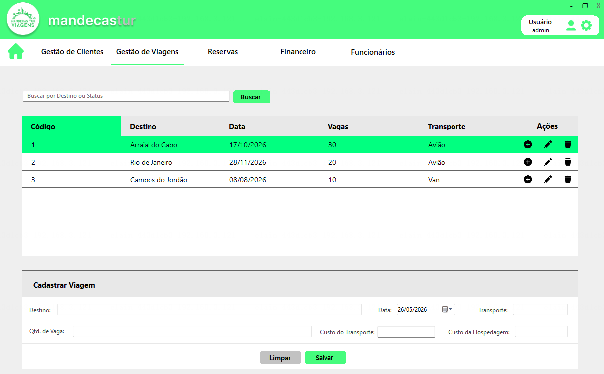

# 🚀 Mandecas Management System

O Mandecas é um sistema completo de gestão desenvolvido para facilitar o controle de clientes, viagens e o acompanhamento financeiro de forma intuitiva e eficiente.

## 📸 Galeria do Sistema

| Dashboard (Modo Padrão) | Dashboard (Green Mode) |
| :---: | :---: |
|  |  |

| Financeiro (Modo Padrão) | Gestão de Viagens |
| :---: | :---: |
|  |  |

---

## 🛠 Tecnologias Utilizadas
* **Linguagem:** C# (.NET Framework)
* **Interface:** Windows Forms (WinForms)
* **Banco de Dados:** MySQL
* **Ferramentas:** Visual Studio

## ⚙️ Funcionalidades Principais
* **Gestão de Clientes:** Cadastro, edição e exclusão de clientes com validação de dados.
* **Controle de Viagens:** Gestão de destinos, vagas e transporte.
* **Controle Financeiro:** Acompanhamento de receitas/despesas com status atualizado.
* **Acessibilidade:** Design responsivo com suporte a modo escuro (Green Mode).

## 🚀 Como rodar o projeto
1. Clone este repositório: `git clone https://github.com/skarlana/Projeto-MandecasTur.git`
2. Abra a Solution no Visual Studio.
3. Certifique-se de configurar a connection string do banco de dados na pasta `database`.
4. Compile e execute o projeto!

## 🔑 Acesso de Teste
Para testar o sistema, você pode utilizar as seguintes credenciais cadastradas no banco de dados:

* **Usuário:** `admin@`
* **Senha:** `1239`

---
## 👥 Desenvolvido por:
* Skarllate Lana
* Franciele Santos
* Vanessa Lima
* Melyssa Ezequiel
* Juliana Nascimento
* Silas Bibiano

*Projeto desenvolvido como trabalho final de conclusão do curso Programador de Sistemas do Transforme-se.*